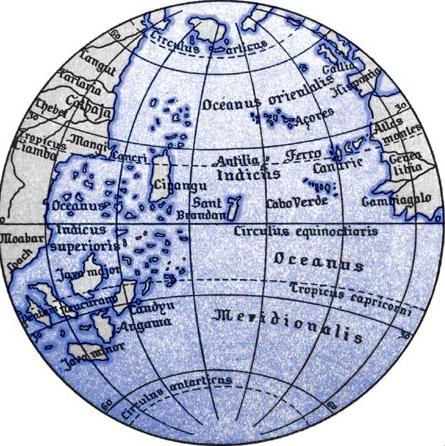
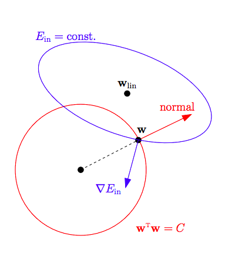
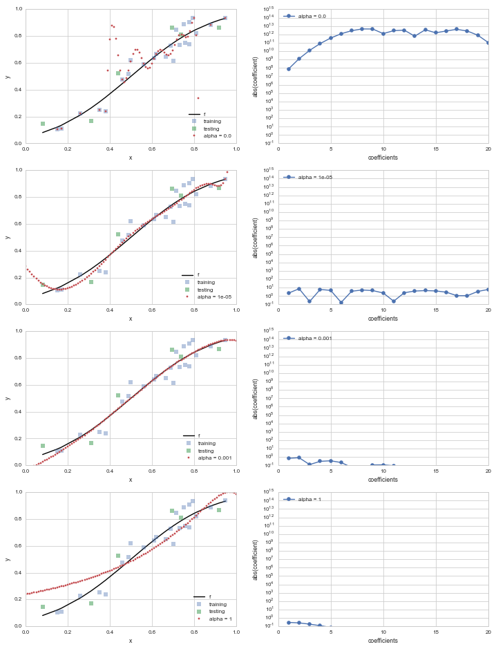
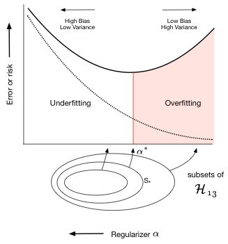
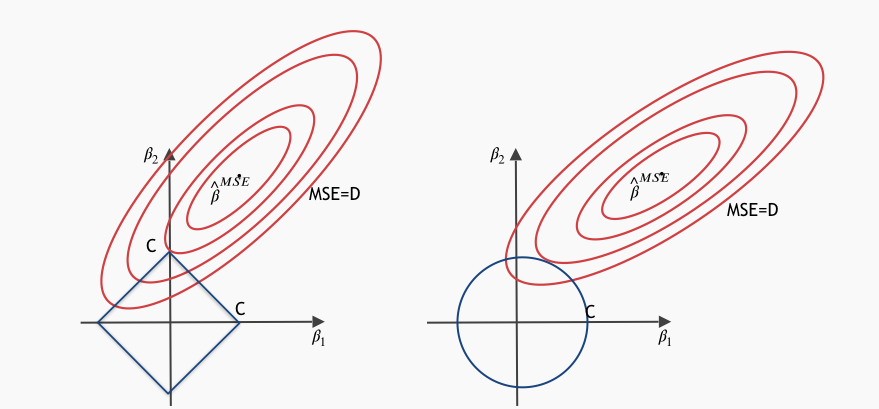
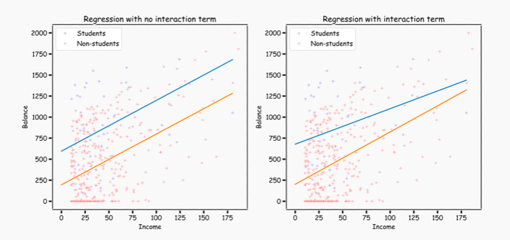

footer:
autoscale: true


---

#[fit] Ai 1

---

#[fit] Learning a Model
# Part2
#[fit] Validation and Regularization

---

## Last Time

1. SMALL World vs BIG World
2. Approximation
3. THE REAL WORLD HAS NOISE
4. Complexity amongst Models
5. Validation

---

## Today

- (0) Recap of key concepts from earlier
- (1) Validation and Cross Validation
- (2) Regularization
- (3) Multiple Features

---

##[fit] 0. From before


---

- *Small World* given a map or model of the world, how do we do things in this map? 
- *BIG World* compares maps or models. Asks: whats the best map? 




(Behaim Globe, 21 inches (51 cm) in diameter and was fashioned from a type of papier-mache and coated with gypsum. (wikipedia))

---


#[fit]RISK: What does it mean to FIT?

Minimize distance from the line?

$$R_{\cal{D}}(h_1(x)) = \frac{1}{N} \sum_{y_i \in \cal{D}} (y_i - h_1(x_i))^2 $$

Minimize squared distance from the line. Empirical Risk Minimization.

$$ g_1(x) = \arg\min_{h_1(x) \in \cal{H_1}} R_{\cal{D}}(h_1(x)).$$

##[fit]Get intercept $$w_0$$ and slope $$w_1$$.

---


#[fit] HYPOTHESIS SPACES

For example, a polynomial looks so:

 $$h(x) = \theta_0 + \theta_1 x^1 + \theta_2 x^2 + ... + \theta_n x^n = \sum_{i=0}^{n} \theta_i x^i$$

All polynomials of a degree or complexity $$d$$ constitute a hypothesis space.

$$ \cal{H}_1: h_1(x) = \theta_0 + \theta_1 x $$
$$ \cal{H}_{20}: h_{20}(x) = \sum_{i=0}^{20} \theta_i x^i$$

---

A sample of 30 points of data. Which fit is better? Line in $$\cal{H_1}$$ or curve in $$\cal{H_{20}}$$?


---

# Bias or Mis-specification Error


---


---

#Statement of the Learning Problem

The sample must be representative of the population!


$$A : R_{\cal{D}}(g) \,\,smallest\,on\,\cal{H}$$
$$B : R_{out} (g) \approx R_{\cal{D}}(g)$$


A: In-sample risk is small
B: Population, or out-of-sample risk is WELL estimated by in-sample risk. Thus the out of sample risk is also small.

---

Which fit is better now?
                                              The line or the curve?


---

#UNDERFITTING (Bias) vs OVERFITTING (Variance)


---

# How do we estimate

# out-of-sample or population error $$R_{out}$$


#TRAIN AND TEST


---


#MODEL COMPARISON: A Large World approach

- want to choose which Hypothesis set is best
- it should be the one that minimizes risk
- but minimizing the training risk tells us nothing: interpolation
- we need to minimize the training risk but not at the cost of generalization
- thus only minimize till test set risk starts going up


---

## Complexity Plot


---


##[fit]1. Validation and 
##[fit]Cross Validation 


---

##[fit] Do we still have a test set?

Trouble:

- no discussion on the error bars on our error estimates
- "visually fitting" a value of $$d \implies$$ contaminated test set.

The moment we **use it in the learning process, it is not a test set**.

---


#[fit]VALIDATION

- train-test not enough as we *fit* for $$d$$ on test set and contaminate it
- thus do train-validate-test


---

## usually we want to fit a hyperparameter

- we **wrongly** already attempted to fit $$d$$ on our previous test set.
- choose the $$d, g^{-*}$$ combination with the lowest validation set risk.
- $$R_{val}(g^{-*}, d^*)$$ has an optimistic bias since $$d$$ effectively fit on validation set

## Then Retrain on entire set!

- finally retrain on the entire train+validation set using the appropriate  $$d^*$$ 
- works as training for a given hypothesis space with more data typically reduces the risk even further.

---

## Whats the problem?

What if we, just by chance had an iffy validation set?

This problem is dire when we are in low data situations. In large data situations, not so much.

We then do 

## cross-validation

Key Idea: Repeat the validation process on different pieces of left out data. Make these left-out parts not overlap so that the risks/errors/mse calculated on each are not correlated.

---


---

#[fit]CROSS-VALIDATION


---


---


#[fit]CROSS-VALIDATION

#is

- a resampling method
- robust to outlier validation set
- allows for larger training sets
- allows for error estimates

Here we find $$d=3$$.

---

## Cross Validation considerations

- validation process as one that estimates $$R_{out}$$ directly, on the validation set. It's critical use is in the model selection process.
- once you do that you can estimate $$R_{out}$$ using the test set as usual, but now you have also got the benefit of a robust average and error bars.
- key subtlety: in the risk averaging process, you are actually averaging over different $$g^-$$ models, with different parameters.

---

Consider a "small-world" approach to deal with finding the right model, where we'll choose a Hypothesis set that includes very complex models, and then find a way to subset this set.

This method is called

##[fit] 2. Regularization

---

##REGULARIZATION: A SMALL WORLD APPROACH

Keep higher a-priori complexity and impose a

##complexity penalty

on risk instead, to choose a SUBSET of $$\cal{H}_{big}$$. We'll make the coefficients small:

$$\sum_{i=0}^j \theta_i^2 < C.$$

---


---

## The math of regularization: small world

Consider the set of 10th order polynomials:

$$\begin{array}{l}{\mathcal{H}_{10}=\left\{h(x)=w_{0}+w_{1} \Phi_{1}(x)+w_{2} \Phi_{2}(x)+w_{3} \Phi_{3}(x)+\cdots+w_{10} \Phi_{10}(x)\right\}} \end{array}$$

Now suppose we just set some of these to 0, then we get $$\mathcal{H}_{2}$$ as a subset:

$$\begin{array}{l} {\mathcal{H}_{2}=\left\{\begin{array}{c}{h(x)=w_{0}+w_{1} \Phi_{1}(x)+w_{2} \Phi_{2}(x)+w_{3} \Phi_{3}(x)+\cdots+w_{10} \Phi_{10}(x)} \\ {\text { such that: } w_{3}=w_{4}=\cdots=w_{10}=0} \\ \end{array}\right.}\end{array}$$

This is called a hard-order constraint. 

---

## $$L_2$$ Regularization or a soft budget constraint

$$\sum_{q=0}^{\mathrm{Q}} w_{q}^{2} \leq C \leftarrow$$ BUDGET

$$\mathcal{H}_{C}=\left\{\begin{array}{c}{h(x)=w_{0}+w_{1} \Phi_{1}(x)+w_{2} \Phi_{2}(x)+w_{3} \Phi_{3}(x)+\cdots+w_{10} \Phi_{10}(x)} \\ {\text { such that: } \sum_{q=0}^{10} w_{q}^{2} \leq C} \end{array}\right.$$ a soft budget constraint

---

## The geometry of regularization



1. Optimal $$\mathbf{w}$$ tries to get as 'close' to $$\mathbf{w}_{lin}$$. Thus, optimal $$\mathbf{w}$$ will use full budget and be on the surface $$\mathbf{w}^{T} \mathbf{w}=C$$.
2. Surface $$\mathbf{w}^{T} \mathbf{w}=C$$, at optimal $$\mathbf{w}$$, should be perpindicular to $$\nabla E_{\text {in. }}$$
3. Normal to surface $$\mathbf{w}^{T} \mathbf{w}=C$$ is the vector $$\mathbf{w}$$.
4. Surface is $$\perp \nabla E_{\text {in }}$$ and thus must be "tangent"

$$\nabla E_{\text {in }}\left(\mathbf{w}_{\text {reg }}\right)=-2 \lambda_{C} \mathbf{w}_{\text {reg }}$$

---

## Back to the Math: the lagrange multiplier formalism

$$\begin{array}{l}{\qquad E_{\mathrm{in}}(\mathbf{w}) \quad \text { is minimized, subject to: } \mathbf{w}^{\mathrm{T}} \mathbf{w} \leq C} \\ {\Leftrightarrow \quad \nabla E_{\mathrm{in}}\left(\mathbf{w}_{\mathrm{reg}}\right)+2 \lambda_{C} \mathbf{w}_{\mathrm{reg}}=\mathbf{0}} \\ {\left.\Leftrightarrow \nabla\left(E_{\mathrm{in}}(\mathbf{w})+\lambda_{C} \mathbf{w}^{\mathrm{T}} \mathbf{w}\right)\right|_{\mathbf{w}=\mathbf{w}_{\mathrm{rgg}}}=\mathbf{0}} \\ {\Leftrightarrow \quad E_{\mathrm{in}}(\mathbf{w})+\lambda_{C} \mathbf{w}^{\mathrm{T}} \mathbf{w} \quad \text { is minimized, unconditionally }} \\ {\text { There is a correspondence: } C \uparrow \quad \lambda_{C} \downarrow}\end{array}$$

---



## ok so now how do we do 

#[fit]REGULARIZATION

$$\cal{R}(h_j) =  \sum_{y_i \in \cal{D}} (y_i - h_j(x_i))^2 +\lambda \sum_{i=0}^j \theta_i^2.$$

As we increase $$\lambda$$, coefficients go towards 0.

Lasso uses $$\lambda \sum_{i=0}^j |\theta_i|,$$ sets coefficients to exactly 0.


---



## Structural Risk Minimization

- Regularization is a subsetting now, 
- of a complex hypothesis set.
- If you subset too much, you underfit
- but if you do not do it enough, you overfit

---

## Regularization with Cross-Validation


---

## Lasso vs Ridge Geometry



---

---


##[fit] 3. Lots of features

## AKA: features are not just polynomial powers

---

## Multiple Regression

$$\mathbf{Y}=\left(\begin{array}{c}{y_{1}} \\ {\vdots} \\ {y_{y}}\end{array}\right), \quad \mathbf{X}=\left(\begin{array}{cccc}{1} & {x_{1,1}} & {\dots} & {x_{1, J}} \\ {1} & {x_{2,1}} & {\dots} & {x_{2, J}} \\ {\vdots} & {\vdots} & {\ddots} & {\vdots} \\ {1} & {x_{n, 1}} & {\dots} & {x_{n, J}}\end{array}\right), \quad \boldsymbol{\beta}=\left(\begin{array}{c}{\beta_{0}} \\ {\beta_{1}} \\ {\vdots} \\ {\beta_{J}}\end{array}\right)$$

$$\begin{array}{c}{\mathbf{Y}=\mathbf{X} \beta+\epsilon} \\ {\operatorname{MSE}(\beta)=\frac{1}{n}\|\boldsymbol{Y}-\boldsymbol{X} \boldsymbol{\beta}\|^{2}}\end{array}$$

$$\widehat{\boldsymbol{\beta}}=\left(\mathbf{X}^{\top} \mathbf{X}\right)^{-1} \mathbf{X}^{\top} \mathbf{Y}=\underset{\beta}{\operatorname{argmin}} \operatorname{MSE}(\boldsymbol{\beta})$$

---

## Colinearity and co-efficients


---

## Boolean and Categorical Variables: One Hot Encoding

```
Income	Limit	Rating	Cards	Age	Education	Gender	Student	Married	Ethnicity	Balance
14.890	3606	283	    2	    34	    11	    Male	No	    Yes	    Caucasian	333
106.02	6645	483	    3	    82	    15	    Female	Yes	    Yes	    Asian	    903
104.59	7075	514	    4	    71	    11	    Male	No	    No	    Asian	    580
148.92	9504	681	    3	    36	    11	    Female	No	    No	    Hispanic	964
55.882	4897	357	    2	    68	    16	    Male	No	    Yes	    Caucasian	331
```

If the predictor takes only two values, then we create an indicator or dummy variable that takes on two possible numerical values. If more than 2 values, then need N-1 columns:

Ethnicity = {Caucasian, Asian, Hispanic} $$\rightarrow$$ Ethnicity = {Caucasian _or_ not, Asian _or_ not}

---

## Regression with categorical variables

$$\begin{aligned} x_{i, 1} &=\left\{\begin{array}{ll}{1} & {\text { if } i \text { th person is Asian }} \\ {0} & {\text { if } i \text { th person is not Asian }}\end{array}\right.\end{aligned}$$

$$\begin{aligned} x_{i, 2}=\left\{\begin{array}{ll}{1} & {\text { if } i \text { th person is Caucasian }} \\ {0} & {\text { if } i \text { th person is not Caucasian }}\end{array}\right.\end{aligned}$$


$$y_{i}=\beta_{0}+\beta_{1} x_{i, 1}+\beta_{2} x_{i, 2}+\epsilon_{i}=\left\{\begin{array}{l}{\beta_{0}+\beta_{1}+\epsilon_{i} \text { if } i \text { th person is Asian }} \\ {\beta_{0}+\beta_{2}+\epsilon_{i} \text { if } i \text { th person is Caucasian }} \\ {\beta_{0}+\epsilon_{i} \text { if } i \text { th person is Hispanic }}\end{array}\right.$$

---

## What do we mean by linear?

We presented polynomial regression as if it was not linear regression. But it is. 

Linearity refers to the coefficients, bot the features.

Here is another example: interaction terms with a categorical variable:

$$\begin{array}{c}{Y=\beta_{0}+\beta_{1} X_{1}+\beta_{2} X_{2}+\epsilon} \\ {Y=\beta_{0}+\beta_{1} X_{1}+\beta_{2} X_{2}+\beta_{3} X_{1} X_{2}+\epsilon}\end{array}$$

Here we interact $$X_1$$ and $$X_2$$. What does this mean?

---



---

As you can see, the number of features can balloon. In many modern problems: startup with few customers but lots of data on them, there are already more predictors than members in your sample.

We then get the :

## Curse of Dimensionality

- data is sparser in higher dimensions
- volume moves to the outside
  
---


---

to cover same fractional volume, you need to go bigger on length in higher dims


---

## Overfitting and the curse

- remember dimensionality in our problems refers to the number of features we have
- each feature (or feature combination which we shall just call a new feature) is a dimension
- thus each member of our sample is a point in this feature space
- notions of distance and volume become hard in this high-dimensional space
- indeed its easier to find "simple models" in this high dimensional space